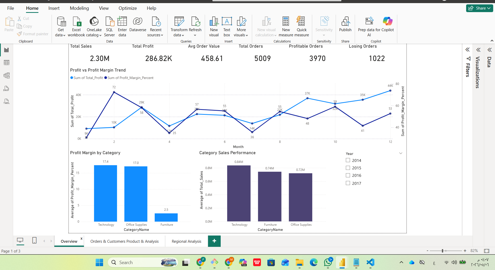

# RetailInsightSQL

## Overview
RetailInsightSQL is a SQL-based retail analytics project focused on analyzing sales performance, profitability, customer behavior, product performance, and regional trends.

The project combines SQL analysis with interactive Power BI dashboards to generate business insights and support data-driven decision-making.

---

## Objectives
- Analyze retail sales and profitability
- Identify top-performing products and regions
- Evaluate customer purchasing behavior
- Explore profit margins across categories
- Build interactive Power BI dashboards

---

## Dashboard Screenshots

### Overview Dashboard

### Orders & Customers Product Analysis

### Regional Analysis Dashboard

---

## Key Insights

- Total sales exceeded 2.30M with total profit reaching 286.82K across more than 5,000 orders.

- Technology products achieved the highest profit margins and strongest sales performance among all categories.

- Furniture showed significantly lower profit margins compared to Technology and Office Supplies.

- Profit and sales trends increased during the final months of the year, indicating seasonal business growth.

- A limited number of customers contributed disproportionately to total orders and profitability.

- Certain products generated substantially higher profit compared to the rest of the catalog.

- California and New York recorded the highest total profits among all states.

- Regional sales performance varied noticeably across months, with East and West regions showing stronger performance.

---

## Technologies Used
- SQL Server
- SQL
- Power BI

---

## Files
- RetailInsightSQL.sql → Main SQL analysis file
- Power BI Dashboard → Interactive business intelligence dashboard

---

## Author
Mohammad Hadi Hayajneh
